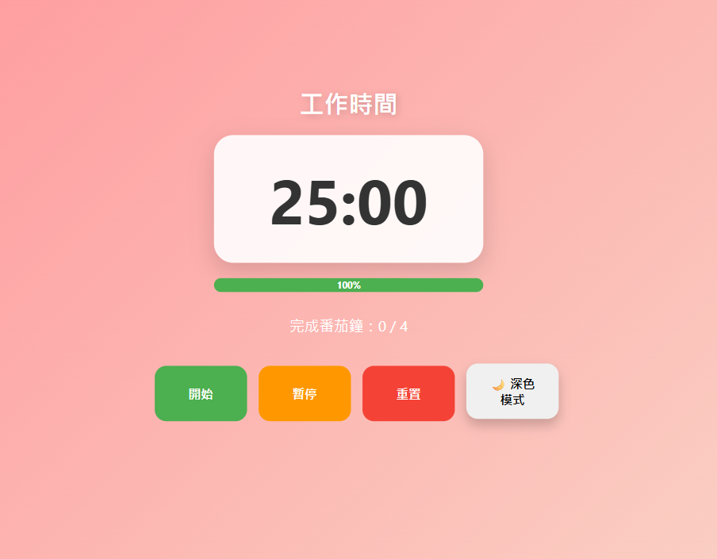
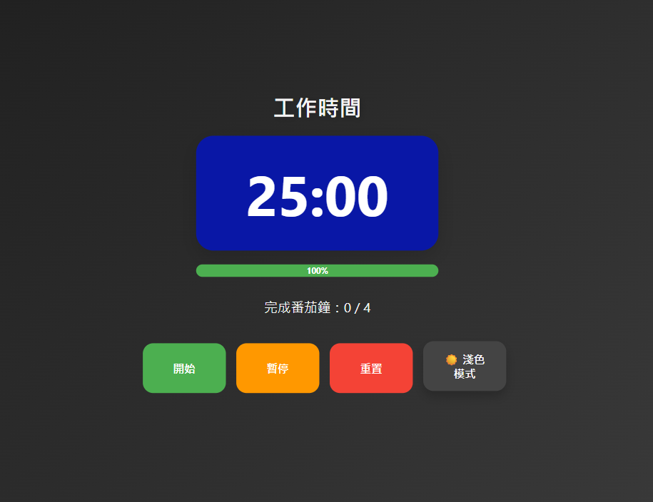
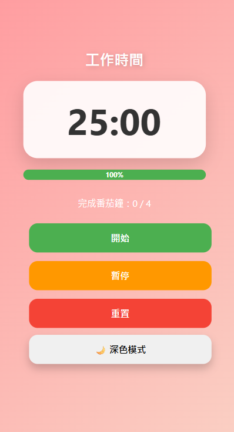

# 🍅 Pomodoro Timer

A simple and responsive Pomodoro Timer built with HTML, CSS, and JavaScript.

---

# 🇺🇸 English

## Features

- ✅ 25-minute work timer
- ✅ 5-minute short break
- ✅ 20-minute long break
- ✅ Progress bar with percentage
- ✅ Dark mode
- ✅ Sound notification
- ✅ Responsive Design (Desktop / Tablet / Mobile)
- ✅ Pomodoro completion counter

---

## Built With

-- HTML5

- CSS3
- JavaScript (Vanilla JS)
- CSS Grid
- Flexbox
- Responsive Web Design

---

## What I Learned

- DOM Manipulation
- setInterval / clearInterval
- State Management
- Responsive Web Design
- Progress Bar Calculation
- Dark Mode Implementation
- Audio API

---

## Screenshots

### Light Mode

### Dark Mode

## Mobile

---

# 🇯🇵 日本語

## 機能

- ✅ 25分の作業タイマー
- ✅ 5分の短い休憩
- ✅ 20分の長い休憩
- ✅ 進捗バー（％表示）
- ✅ ダークモード
- ✅ 通知音
- ✅ レスポンシブ対応
- ✅ ポモドーロ完了回数の表示

---

## 使用技術

- HTML5
- CSS3
- JavaScript (Vanilla JS)
- CSS Grid
- Flexbox
- Responsive Web Design

---

## 学んだこと

- DOM操作
- setInterval / clearInterval
- 状態管理（State Management）
- レスポンシブデザイン
- 進捗率の計算
- ダークモードの実装
- Audio API

---

# 🇹🇼 中文

## 功能

- ✅ 25 分鐘工作模式
- ✅ 5 分鐘短休息
- ✅ 20 分鐘長休息
- ✅ 進度條與百分比
- ✅ 深色模式
- ✅ 音效提醒
- ✅ 響應式網頁設計（RWD）
- ✅ 番茄鐘完成次數統計

---

## 使用技術

- HTML5
- CSS3
- JavaScript (Vanilla JS)
- CSS Grid
- Flexbox
- Responsive Web Design

---

## 學習重點

- DOM 操作
- setInterval / clearInterval
- 狀態管理
- 響應式網頁設計
- 進度條百分比計算
- 深色模式實作
- Audio API

---

## 專案結構

Pomodoro-Timer
│
├── images
│ ├── light-mode.png
│ ├── dark-mode.png
│ └── mobile.png
├── index.html
├── style.css
├── script.js
└── README.md

---

## Future Improvements

- Save settings with localStorage
- Custom work/break time
- Daily statistics
- Chart.js dashboard
- PWA support

---

## Why I Built This Project

I built this project to practice JavaScript state management,
DOM manipulation, and responsive design while creating a useful productivity tool.

このプロジェクトでは、
JavaScriptの状態管理、DOM操作、
レスポンシブデザインを実践しながら、
実用的な生産性ツールを作成しました。

---

## Author

### Chih-Wen Cheng

- GitHub:https://github.com/ryolovechuanchuan
- Portfolio:
- LinkedIn:https://www.linkedin.com/in/chih-wen-cheng-28b6b3418/
